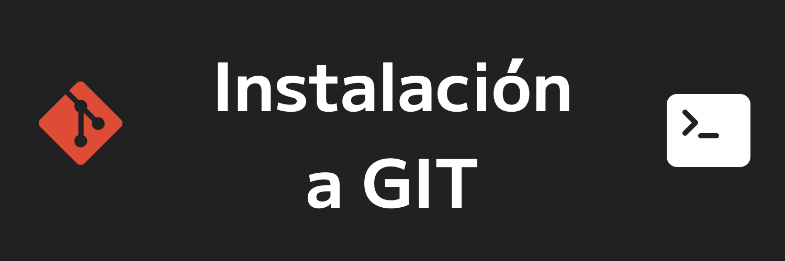

## 1. Terminal
Antes de instalar, visualizaremos si ya tenemos instalado git, ya que en algunos sistemas operativos ya lo incorpora.

Podemos verificar si ya lo tenemos instalado utilizando una terminal de comandos. La terminal nos ayuda a ejecutar comandos tipo peliculas de Hollywood que para nada es difícil y a lo largo de tu vida como dev, irás aprendiendo a manejar.

**Windows**: La terminal que trae por defecto es cmd, también puedes utilizar otras terminales que podrás descargar más adelante. 

Para abrir cmd puedes darle al buscador de windows y buscar cmd. Si te encuentras en un windows que no tiene buscador, puedes utilizar la tecla `[Windows + R]` y se abrirá una ventana donde deberas escribir `cmd` y automáticamente se te abrirá la terminal de windows.

**Mac**: En la lupa superior de búsqueda, podemos buscar `terminal` y seleccionar la aplicación.

**Linux**: Dependiendo de cada distribución, pero en un plano general, la podemos encontrar en nuestras herramientas como `Terminal`.

---

Una vez dentro de nuestra terminal, utilizaremos el comando:
```Bash
git --version
```

Esté comando nos ayudará a visualizar la versión de git que en su caso, tuvieramos instalada.

Puede que no tengas git instalado, así que seguiremos con el tutorial.

## 2. Instalación

### Instalación de Windows y Mac

Iremos al [sitio oficial de git](https://git-scm.com/downloads) y automáticamente nos selecciona el sistema operativo, daremos click en Descargar.

Cuando vayamos a instalar, nos irá  preguntando cuál será la configuración. Puedes dar next a todo sin problema.

### Instalación en Linux

Nos iremos a la terminal y actualizaremos la lista de paquetes con el comando:
```Bash
sudo apt-get update
```
y Después
```Bash
sudo apt-get upgrade
```
Una vez teniendo actualizado nuestros paquetes, actualizaremos el git de nuestra máquina con:
```Bash
sudo apt-get install git
```

### Verificar Git
Verificaremos si ya tenemos instalado git con el comando que usamos más arriba:
```Bash
git --version
```
y nos aparecerá ya la versión de git instalada.
```prompt
2.36.0
```

## Configuración

Para definir el usuario y correo que estaremos utilizando y probablemente el que se una con GitHub, tendremos que configurar nuestro entorno modificando las variables de nombre y correo de git.

Para esto, dentro de nuestra terminal utilizaremos el comando y modificando lo que está dentro de las `""` sin borrarlas: 
```Bash
git config --global user.name "Aquí va tu nombre. Mucho Ojo"
```
y para configurar tu correo, recomendable que sea el que ya tengas en tu cuenta de Github:
```Bash
git config --global user.email "Aquí va tu correo"
```
Y por ultimo, definimos la rama `main` como principal (antes llamada rama `master`).
```Bash
git config --global init.defaultBranch main
```

Ya podemos pasar a la sección <a href='2_Introduccion.md'>2. Introducción a Git</a>.
