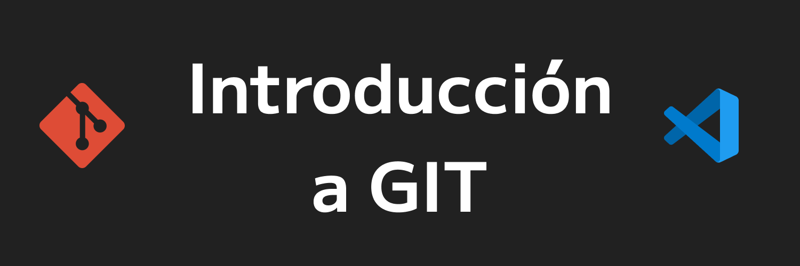
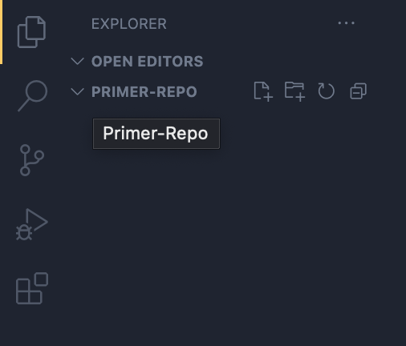

## Introdución a Git

Git nos ayudara a manejar las versiones de estados sobre nuestros archivos. ¿A que se refiere estados?. ¿Recuerdas lo que dicen de TesisFinal y luego es TesisFinal2 y despues es TesisFinalFinal? lo que te ayuda git es a trabajar esas versiones que vas manejando. Ahora imaginate que ese archivo no solo lo editas tu, si no más personas, entonces para poder ver los cambios que se realizen, git te permite visualizar lo que ha subido cada quien. Tambien puedes saltar en el tiempo, volviendo a un estado anterior y empezando desde ahí. 

### Creando un repositorio

Un repositorio sera una carpeta donde se trabajara todo este control de versiones. 
Para inicializar un repo, primero debemos situarnos en la carpeta que desemos tener este control de versiones.

#### 1. Crearemos una carpeta en el escritorio se llame: `Primer-Repo`. 

La carpeta `Primer-Repo` la estaremos definiendo para utilizarlo con GitHub.

Regularmente se crean estos repos en el escritorio, pero esto ya depende de donde te guste trabajar tus carpetas.

#### 2. Debemos situarnos en la carpeta.

Para "situarnos" debemos movernos dentro de la consola.

Cuando inicias la terminal, esta te situa en un punto especifico de tu computadora. Regularmente en la carpeta del Usuario. 


En Windows nos sale la ruta donde estamos posicionados:

```Bash
C:\User\Daniel>
```

Pero en otros sistemas solo nos aparece el nombre y computadora
```Bash
Daniel@Mycomputadora ~ %
```

Para visualizar en donde te encuentras puedes utilizar el siguiente comando.

Para Mac y Linux:
```Bash
pwd
```

El resultado sera la carpeta en donde la terminal esta situada. 

Puedes visualizar los archivos que contiene la carpeta en donde te cuentras , utilizando:

Para Windows: 
```Bash
dir
```

Para Mac y Linux:
```Bash
ls
```

Ahora que sabes que archivos contiene la carpeta en donde estamos, nos vamos a mover a la carpeta `Desktop` donde se encuentra la carpeta `Primer-Repo`.

Para podernos mover entre carpetas utilizaremos el comando `cd` + espacio + "Nombre de la carpeta" a la que nos vamos a mover.

```Bash
cd Desktop
```

Veremos que en nuestro nombre de la terminal nos añadira la carpeta que nos movimos. 

Haremos lo mismo para entrar a nuestro `Primer-Repo`:

```Bash
cd Primer-Repo
```

#### 3. Inicializar el primer respositorio.

Ya una vez que nuestra consola este situada en la carpeta que estaremos trabajando, utilizaremos el comando de git:

```Bash
git init
```

Nota: Recuerda verificar que estas en la carpeta `Primer-Repo` con `pwd` por que aveces uno puede estar en Desktop y dar el `git init` y liarla.  

#### 4. Subiendo nuestro primer archivo.

Una vez inicido el git, ya podremos utilizar el manejo de versiones con nuestros archivos.

Aqui ya estaremos utilizando nuestro editor de código. 

Para este ejemplo utilizaremos VS CODE pero recuerda que es el de tu preferencia.

Los pasos son muy similares a otros editores.

Abriremos VS CODE y nos iremos a File y ahí seleccionaremos `Open Folder` y buscaras nuestro repo, lo seleccionas y le das a boton [Seleccionar carpeta] o [Abrir]. Si le das enter, solo entraras a la carpeta como si fueras a buscar adentro. 

Tambien en tu terminal puedes teclear:
```Bash
code 
```
Y se abrira una ventana de VS CODE en la carpeta `Primer-Repo`. A veces no esta configurado esta opción pero es muy facil de hacerlo.

Ya dentro de nuestro VS CODE de lado izquierdo tenemos un icono llamado `Explorer` donde podremos visualizar todas las carpetas y archivos que estan dentro de la carpeta `Primer-Repo`.

Puede verse así:




Ya podemos pasar a la sección <a href='3_Modificando_archivos.md'>3. Modificando_archivos</a>.