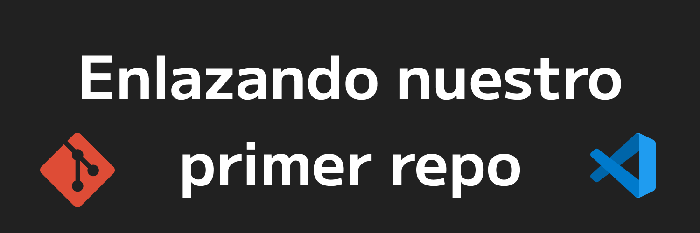
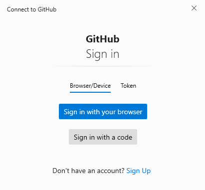
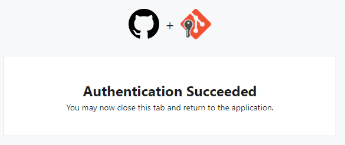
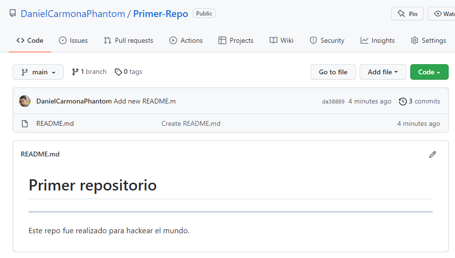

## Enlazando nuestro primer Repo

Ya tenemos por un lado el repo de las carpetas con su control de versiones, pero nos falta asignarlo a un repo de GitHub. Para esto haremos lo siguiente:

1. Iremos a GitHub, accederemos a nuestra cuenta y en la esquina superior derecha abra un icono + donde al darle click, nos aparecerá la opción de crear un nuevo repositorio. También sueles encontrar un botón Verde que también tiene la misma funcionalidad.

Si no menciono algo aquí, no le muevas.

2. Nos llevará a una página nueva para los detalles de nuestro repo. Agregaremos un nombre. En esté caso podriamos poner `Primer-Repo`.

3. Dejalo en Public.

4. Te preguntará si quieres inicializar el repo con un archivo README, nuestra carpeta local ya contiene ese archivo así que **no** seleccionaremos la casilla.

5. El .gitignore son carpetas/archivos que no quieres que se suban al repositorio de GitHub. Más adelante aprenderás de ellos. 

6. Licencia en None

7. Daremos click al botón verde [Create Repository]

Una vez creado tu respositorio, te pondrán las instrucciones para enlazar tu repo de GitHub con el de tu computadora.

Seguiremos el tutorial de la sección **…or create a new repository on the command line** donde vemos que algunos pasos ya los realizamos. 

Nos indica que debemos definir una rama Main con el comando: 

```git
git branch -M main
```

Para entender un poquito las Ramas veremos la siguiente:

En los equipos de desarrollo, y dependera mucho de su manejo, utilizarán ramas para poder trabajar sus cambios.

Está es como la base donde podemos ver que tenemos 4 ramas: Main, Release, Develop y Features.

* Main: La rama main es la rama principal (antes llamada Master) y suele utilizarse como la rama de producción. Esto se refiere a que estarán los archivos ya desplegados y listos para usarse en nuestra aplicación.

* Release: Suele no estar presente pero depende de tu equipo y es para la preparación a la hora de unir algún cambio proveniente de la rama de develop para que esté listo para incorporarse a prod.

* Develop: Rama utilizada para los cambios de los desarrolladores, bugs que hayan salido.

* Features: está como otras ramas de apoyo, te ayudan con características nuevas, pero depende mucho de la estructura.


Para entender más sobre estas ramas, puedes buscar en internet documentación de todo el Git Flow.

Las ramas empiezan ya a trabajarse cuando participas en un equipo de desarrollo. Mientras estaremos utilizando la rama Main.

Así que en nuestra terminal sí utilizaremos el comando:

```git
git branch -M main
```

Después nos dice que usemos el comando git remote, que nos ayudará a realizar la sincronización del repo de Github con nuestro repo local. Utilizaremos el comando que nos aparece ahí ya que ese incluye nuestro nombre se usuario y el nombre del repo. 

```git
git remote add origin https://github.com/TUNOMBRE/Primer-Repo.git
```

Si todo salio bien, no nos devolverá nada.

Ya tenemos enlazado nuestra carpeta local con nuestro repo de GitHub, pero nos faltan subir esos cambios que hicimos en nuestro repo local.

Para eso nos indica que usemos el comando. 

```git
git push -u origin main
```

Esté comando subirá los commits realizados a nuestro repo de GitHub en la rama Main. 

Para esto nos pedirá autentificarse si no, todos podrían subir carpetas a repos de cualquier persona.

Nos dice que abrirá una ventana en el navegador predeterminado para hacer la autentificación. Si no te aparece esto, lee más abajo.



Después de poner nuestro usuario, nos aparecerá lo siguiente:



Y en nuestra consola aparecerá que se realizaron los cambios perfectamente.

Ya podemos ir a nuestra página del repo donde aparecían las instrucciones, refrescar la página y ¡ver nuestro README!




## ¡¡Felicidades!!


Ahora ya tienes tu repositorio que se encontraba en tu local, en tu Github. Recuerda que cuando vas a trabajar un NUEVO proyecto, estos son los pasos que debes realizar.

CUANDO MODIFICAS un archivo en tu local, este cambio debe ser agregado al repositorio de github. Solamente debes agregar el archivo con 
```Bash
git add .
```
Ya que esta agregado, realizas tu commit correspondiente.
```
git commit -m "refactor: Cambie x cosa en x archivo"
```

Y por último subes tu cambio:
```
git push origin main
```

Listo! cada que modifiques tus archivos, solo debes hacer esos 3 pasos. 

Easter egg: Crea un repo en GitHub llamado de la misma forma que tu nombre de usuario y agregale el README.md.


Notas: Si cuando le diste push, en la consola te pidió logearte y pidio un Username y un password, el password es el acces token. Github implementó que a veces tienes que utilizar un access token, no es complicado solo es para más seguridad y puedes encontrar en internet muchos tutoriales al respecto.
