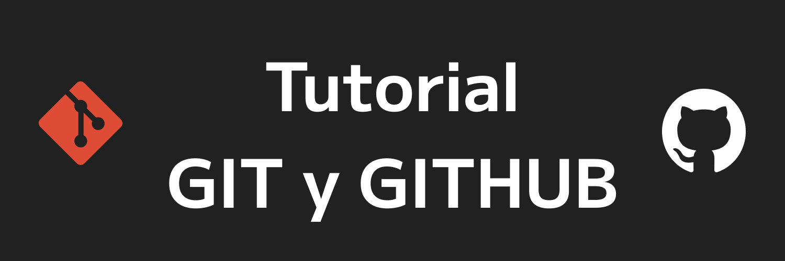

Esté tutorial está diseñado para instalar git desde cero, aprender un poco de terminal y hasta crear tus propios repositorios.

El tutorial estará dividido en las siguientes secciones:

Contenido:
1. <a href='1_Instalacion.md'>Instalación</a>.
2. <a href='2_Introduccion.md'>Introducción a Git</a>.
3. <a href='3_Enlace.md'>Enlazando nuestro primer Repo</a>.
<!-- 3. <a href='4_Modificando_archivos.md'>Modificando archivos</a>. -->
<!-- 4. Crear presentación en Github -->

Empezaremos con <a href='1_ Instalacion.md'>1. Instalación</a>.

